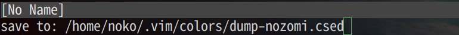
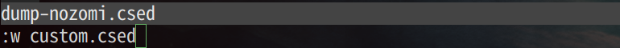

# vim-colorscheme-edit


## Introduction

A text-based easily colorscheme editor (or dumper) on vim.

Features:  

- Text-based colorscheme editor (or dumper).
- Can check colors visually on vim.
- Can output both terminal and GUI colorschemes.
- Can output simple codes.
- Uses the native file format (.csed) which is easy to edit.
- Uses mainly 256 index colors.
- Supports for both gVim and Terminal Vim version 7.0+.
- Written in 100% vimscript with no outside dependencies.

## Screenshots


## Usage

#### 1. Dump current colorscheme

First, just try

```vim
:DumpColorScheme
```




After this operation, a file "dump-{colorscheme}.csed" will be created in the
directory "~/.vim/colors/" and opened.


\*.csed is native format to discribe colorscheme.

#### 2. Rename and Edit {colorscheme}.csed

You can rename the .csed file to your preferred name.

```vim
:w my_custom_colorscheme.csed
:e my_custom_colorscheme.csed
```




The basename of .csed is used as the colorscheme name.

#### 3. Check highlight colors

Press <kbd>CTRL-l</kbd>


will update highlights, and you can check colors visually.

#### 4. Build

Press <kbd>CTRL-s</kbd>


The colorscheme file "{basename}.vim" will be created in "~/.vim/colors/".


Finally you'll get your own colorscheme.

- - -

Csedit uses 256 index colors, you can check it with this URL.  
<https://github.com/nokobear/vim-colorscheme-edit/blob/master/img/presets/tango.png>


- - -

See more ditails.

```vim
:help csedit
```

## Installation

Use a package manager like vim-plug.

Using [vim-plug](https://github.com/junegunn/vim-plug):

```vim
Plug 'nokobear/vim-colorscheme-edit'
```
